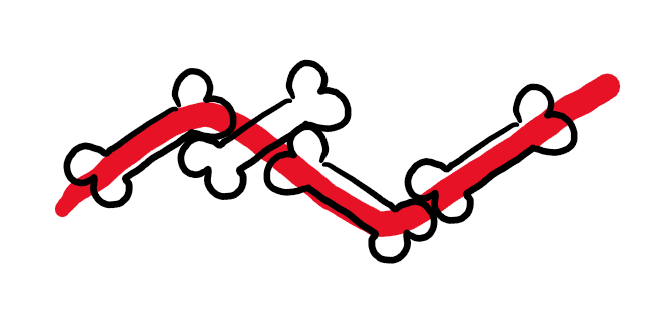
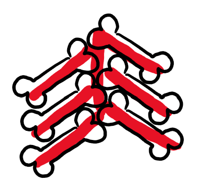

# Medulla

**The Medulla Project** is an open-source initiative to develop a shared planning document that outlines a core sequence of Latin vocabulary and grammar. This sequence enables chapter-by-chapter compatibility across different Latin textbooks, allowing educators to interchange materials more easily.

## Core values
1. The Medulla project will be released under the Creative Commons Zero (CC0) license, dedicating its content to the public domain and allowing unrestricted commercial and non-commercial use. 
2. The document specifies a standardised sequence of core grammar and vocabulary to enable chapter-by-chapter cross-compatibility between resources.
3. Beyond the core sequence, the project aims to allow for maximal freedom of implementation. This includes such choices as pedagogical approach, story setting and subject matter, modes of delivery, use of L1, role of metalanguage, teaching of derivatives, etc.
4. The Medulla framework does not serve as an endorsement of textbook quality; it is designed solely for cross-compatibility. Responsibility for textbook quality remains with individual authors and publishers.
5. Community involvement is essential to ensure the framework is relevant, representative, and adaptable across contexts. We actively seek feedback from Latin teachers from different regions, demographics, and pedagogical approaches.
6. The Medulla framework will be maintained with transparent versioning and changelogs, allowing users to track updates and ensure compatibility across editions.

## Approach to Grammar
We aim to balance pragmatic and systematic sequencing of grammar, prioritizing pedagogical practicality where necessary and maintaining structural coherence where possible.

## Approach to Vocabulary
We aim to establish a lean, shared sequence of topic-neutral vocabulary that will not limit subject matter. Textbooks can then build on this core with their own topic-specific vocabulary.

